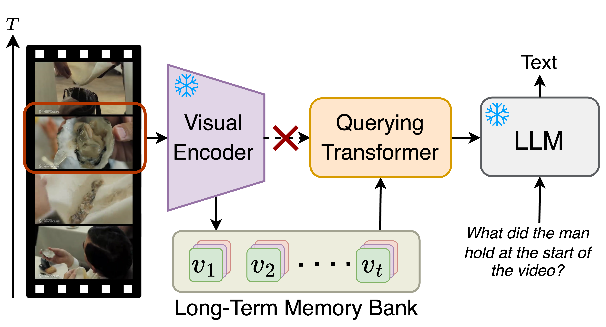

# (2024CVPR) MA-LMM: Memory-Augmented Large Multimodal Model for Long-Term Video Understanding
### [Project Page](https://boheumd.github.io/MA-LMM/) | [Paper](https://arxiv.org/abs/2404.05726)
The official repository of our paper "**MA-LMM: Memory-Augmented Large Multimodal Model for Long-Term Video Understanding**".

[](https://paperswithcode.com/sota/video-classification-on-breakfast?p=ma-lmm-memory-augmented-large-multimodal)
[](https://paperswithcode.com/sota/video-classification-on-coin-1?p=ma-lmm-memory-augmented-large-multimodal)
[](https://paperswithcode.com/sota/visual-question-answering-on-msvd-qa-1?p=ma-lmm-memory-augmented-large-multimodal)
[](https://paperswithcode.com/sota/video-question-answering-on-msrvtt-qa?p=ma-lmm-memory-augmented-large-multimodal)
[](https://paperswithcode.com/sota/video-captioning-on-youcook2?p=ma-lmm-memory-augmented-large-multimodal)


<p align="center">

</p>


## Model Overview
<p align="center">

</p>

## Demo
You can explore our demo by running `demo.ipynb`. This demonstration illustrates how our MA-LMM serves as a plug-and-play module that can be integrated into InstructBLIP seamlessly, requiring no fine-tuning for zero-shot evaluation.

## Requirements

You can install the conda environment by running:
```bash
git clone https://github.com/boheumd/MA-LMM.git
cd MA-LMM
pip install -e .
```

If you are running the code on Apple Silicon, you need to use `eva-decord` instead of `decord`. Here is the modification in the `requirements.txt` file you should do:

```text
contexttimer
eva-decord
einops>=0.4.1
fairscale==0.4.4
...
```

**Before running `pip install -e .`, ensure you have the correct requirements.**

## Dataset
For the long-term video understanding task, we conduct experiments including ([LVU](https://github.com/chaoyuaw/lvu)) and two standard video summarization datasets ([Breakfast](https://serre-lab.clps.brown.edu/resource/breakfast-actions-dataset/), [COIN](https://coin-dataset.github.io/)).

For the video question answering task, we conduct experiments including [MSRVTT](https://github.com/xudejing/video-question-answering), [MSVD](https://github.com/xudejing/video-question-answering), and [ActivityNet](https://github.com/MILVLG/activitynet-qa).
For the video captioning task, we also conduct experiments on [Youcook2](http://youcook2.eecs.umich.edu/) dataset.

You can download videos for each dataset through the script provided here (lavis/datasets/download_scripts). For LVU/Breakfast/COIN datasets, please download the original videos through the official link provided above.

Then extract video frames of each video with fps=10. Example preprocess code is provided here [extract_frames.py](https://github.com/boheumd/MA-LMM/blob/main/data/extract_frames.py).
Since different FFMPEG versions are used, the actual extracted frame lengths can be slightly inconsistent. You may need to update the actual frame_length for each video in the annotation file.
   ```
    ├── data
        └── activitynet
            ├── annotation
            ├── frames
            ├── videos
        └── breakfast
            ├── annotation
            ├── frames
            ├── videos
        └── coin
            ├── annotation
            ├── frames
            ├── videos
        └── lvu
            ├── annotation
            ├── frames
            ├── videos
        └── msrvtt
            ├── annotation
            ├── frames
            ├── videos
        └── msvd
            ├── annotation
            ├── frames
            ├── videos
        └── youcook2
            ├── annotation
            ├── frames
            ├── videos
   ```


## Running

### Download Pre-trained LLM
We use Vicuna-v1.1 as our pre-trained LLM weights, you can download from this [link](https://github.com/lm-sys/FastChat/blob/main/docs/vicuna_weights_version.md) as arrange in this format.
   ```
   ├── llm
        ├── vicuna-7b
        ├── vicuna-13b
   ```
### Finetuning on Downstreaming Tasks
Our model leverages pre-trained weights from [InstructBlip](https://github.com/salesforce/LAVIS/tree/main/projects/instructblip), which was only pre-trained on image-text pairs. Our training process occurred on four A100 GPUs. If you would like to fine-tune the model for various video datasets, please run the following command:
```bash
bash run_scripts/${dataset}/train.sh
```

#### LVU dataset
```bash
    # Please choose the task from the following list
    # ['director', 'genre', 'relationship', 'scene', 'way_speaking', 'writer', 'year']
    datasets.lvu_cls.task ${task}
```

### Testing
We also provided finetuned checkpoints for each video dataset. Please download the [saved_model.tar](https://drive.google.com/file/d/1mq6fg69Ofm32-1HjEunoFtPg8ymAIcOp/view?usp=sharing) and unzip it. 
For the test script corresponding to each dataset, provide the path to the extracted checkpoint to execute the evaluation.
```bash
bash run_scripts/${dataset}/test.sh ${checkpoint_path}
```

### Zero-shot Evaluation
Our model can also leverage pre-trained weights from [InstructBlip](https://github.com/salesforce/LAVIS/tree/main/projects/instructblip) without any finetuning to conduct zero-shot evaluation on video datasets.
```bash
bash run_scripts/${dataset}/test.sh
```


### Hyper-parameters
One important hyper-parameters memory_bank_length, please change that in the training script on different datasets.
```bash
    # pre-defined length of the memory bank
    model.memory_bank_length ${value}
    # value=0 means without using the memory bank
```

### Memory Bank Compression Code
The core algorithm for the memory bank compression algorithm is [here](https://github.com/boheumd/MA-LMM/blob/main/lavis/models/blip2_models/blip2.py#L352).

## Citation
If you find our code or our paper useful for your research, please **[★star]** this repo and **[cite]** the following paper:

```latex
@inproceedings{he2024malmm,
  title = {MA-LMM: Memory-Augmented Large Multimodal Model for Long-Term Video Understanding},
  author    = {He, Bo and Li, Hengduo and Jang, Young Kyun and Jia, Menglin and Cao, Xuefei and Shah, Ashish and Shrivastava, Abhinav and Lim, Ser-Nam},
  booktitle = {Proceedings of the IEEE/CVF Conference on Computer Vision and Pattern Recognition (CVPR)},
  year = {2024}
}
```


## Acknowledgement
We referenced the repo below for the code
- [LAVIS](https://github.com/salesforce/LAVIS)


